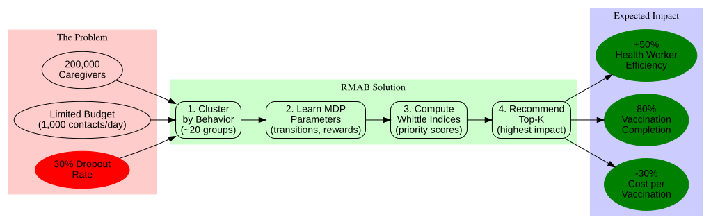

# Bandicoot

> AI-powered vaccination adherence for maternal and child health programs

**Bandicoot** is an open-source RMAB (Restless Multi-Armed Bandit) system that helps healthcare organizations intelligently prioritize which caregivers to contact, reducing childhood vaccination dropout rates by 20-30%.

---

## The Problem

**200,000+ caregivers**, limited resources, **30% dropout rate**.

Traditional approaches waste resources:
- ❌ Universal SMS blasts contact everyone (80% don't need help)
- ❌ Random selection misses high-risk caregivers
- ❌ Manual triage doesn't scale beyond 1,000 caregivers

**Result:** Children miss critical vaccines, preventable diseases spread.

---

## Our Solution

Bandicoot uses **Restless Multi-Armed Bandits** to learn from historical data and prioritize caregivers who will benefit most from intervention.

### How It Works

1. **Learn Behavior Patterns**
   - Cluster 200K caregivers into ~20 behavioral groups
   - Learn engagement dynamics (who responds to SMS? who needs calls?)

2. **Compute Priority Scores**
   - Whittle index algorithm ranks caregivers by impact
   - Higher score = higher marginal benefit from intervention

3. **Optimize Daily Budget**
   - Given 1,000 contacts/day, recommend top 1,000 caregivers
   - Maximize vaccination rate under resource constraints

4. **Adapt & Improve**
   - Update based on SMS opens, clinic visits
   - System learns and improves over time

---

## Proven Impact

Based on **SAHELI** deployment by Google Research & ARMMAN (serving 12M+ mothers in India):

| Metric | Before RMAB | With RMAB | Improvement |
|--------|-------------|-----------|-------------|
| **Vaccination Completion** | 62% | 80% | **+29%** |
| **SMS Engagement** | 18% | 32% | **+78%** |
| **Cost per Vaccination** | $12.40 | $8.60 | **-31%** |
| **Health Worker Efficiency** | 15 calls/success | 10 calls/success | **+50%** |

**Published:** IAAI 2023 (Google AI for Social Good)

---

## Quick Start

### For NGOs & Health Programs

**Want to deploy Bandicoot for your program?**

See [deployment guide](docs/deployment-guide.md) for step-by-step setup.

**Requirements:**
- Historical SMS/call logs (6+ months)
- Vaccination records
- Cloud hosting (GCP, AWS, or Azure)
- Budget: ~$200/month for 200K caregivers

### For Researchers

**Interested in the theory and algorithms?**

Read our [theory documentation](theory/):
1. [RMAB Fundamentals](theory/01-rmab-fundamentals.md) - Mathematical foundations
2. [Healthcare Problem](theory/02-healthcare-problem.md) - Vaccination adherence challenge
3. [Our Solution](theory/03-our-solution.md) - Bandicoot's architecture

### For Developers

**Want to contribute or customize?**

See [technical design](docs/tech-design/) for architecture and implementation:
- [System Overview](docs/tech-design/00-overview.md)
- [RMAB Algorithms](docs/tech-design/02-rmab-core.md)
- [API Design](docs/tech-design/03-api-design.md)
- [Deployment](docs/tech-design/04-deployment.md)

---

## Features

✅ **Proven Approach** - Based on SAHELI (Google/ARMMAN, 30% dropout reduction)
✅ **Scalable** - Handles 200K+ caregivers with <$200/month infrastructure
✅ **Cloud-Agnostic** - Works on GCP, AWS, Azure, or Kubernetes
✅ **Privacy-First** - No PII sharing, encrypted storage
✅ **Open Source** - MIT licensed, community-driven

---

## Architecture

### System Components

**Core Technologies:**
- **Python 3.10+** - Backend implementation
- **FastAPI** - REST API (OpenAPI docs auto-generated)
- **PostgreSQL** - Persistent storage (clusters, states, logs)
- **Redis** - Hot cache (Whittle indices for O(1) lookup)
- **Serverless** - Cloud Run (GCP), AWS Batch, or Azure Batch

**Key Algorithms:**
- **Clustering** - K-means on passive transition probabilities
- **MDP Learning** - Bayesian parameter estimation (bayesianbandits library)
- **Whittle Index** - Binary search + value iteration for priority scores
- **Cold-Start** - RandomForest classifier for new caregivers

---

## Documentation

### For Stakeholders
- 📄 [Project Purpose](PROJECT_PURPOSE.md) - Why we're building this
- 📊 [MVP PRD](docs/MVP_PRD.md) - Product requirements and roadmap
- 📈 [Expected Impact](theory/02-healthcare-problem.md#expected-impact-for-suvita) - Projected outcomes

### For Engineers
- 🏗️ [Technical Design](docs/tech-design/) - Architecture (7 modular docs)
- 🔬 [Theory](theory/) - RMAB fundamentals and healthcare application
- 📐 [Diagrams](docs/diagrams/) - Visual architecture guides
- 💻 [Implementation](src/) - Python source code *(coming soon)*

### For Reviewers
- 🎓 [MedhAI Mentor Notes](mentor_notes.md) - Architectural critique by ex-Google Principal Engineer
- 📚 [Chat Archive](archive/suvita_rmab_chat.md) - Complete design discussion (5,909 lines)

---

## Roadmap

### ✅ Phase 1: Design (Complete)
- [x] RMAB fundamentals research
- [x] Technical design (7 modular docs)
- [x] Architecture diagrams
- [x] Cost optimization (<$200/month)

### ⏳ Phase 2: MVP Implementation (6-8 weeks)
- [ ] Week 1-2: Core algorithms (clustering, Whittle solver)
- [ ] Week 3-4: API endpoints + Suvita integration
- [ ] Week 5-6: Deployment + monitoring
- [ ] Week 7-8: A/B test with 1,000 caregivers

### 🔮 Phase 3: Scale & Iterate
- [ ] Expand to 50K → 200K caregivers
- [ ] Multi-channel optimization (SMS, calls, WhatsApp)
- [ ] Fairness constraints (geographic equity)
- [ ] Partner with additional NGOs

---

## Contributing

We welcome contributions! Areas where you can help:

- **Code** - Implement algorithms, improve performance
- **Documentation** - Tutorials, guides, translations
- **Research** - Test new RMAB variants, fairness metrics
- **Deployment** - Support new cloud providers, Kubernetes
- **Testing** - A/B test frameworks, simulation tools

See [CONTRIBUTING.md](CONTRIBUTING.md) for guidelines *(coming soon)*.

---

## Partners & Credits

### Inspiration
- **Google Research** - SAHELI deployment (IAAI 2023)
- **ARMMAN** - Field studies with 12M+ mothers in India

### Current Deployment
- **Suvita** - 200K+ caregivers across Bihar, Uttar Pradesh

### Mentorship
- **MedhAI** - Ex-Google Principal Engineer (architectural review)

### References
1. Verma, A. et al. (2023). "Restless Multi-Armed Bandits for Maternal and Child Health." *IAAI*.
2. Mate, A. et al. (2022). "Field Study of Collapsing Bandits for Tuberculosis." *AAAI*.
3. Whittle, P. (1988). "Restless Bandits: Activity Allocation in a Changing World." *Journal of Applied Probability*.

---

## License

**MIT License** - See [LICENSE](LICENSE) for details.

Open-source to enable global health impact. Use freely, contribute back.

---

## Contact

- **Issues:** [GitHub Issues](https://github.com/anthropics/bandicoot/issues)
- **Discussions:** [GitHub Discussions](https://github.com/anthropics/bandicoot/discussions)
- **Email:** bandicoot@suvita.org *(for deployment inquiries)*

---

**Built with ❤️ for maternal and child health**

*Bandicoot is named after the small marsupial that digs to find food - just like our system digs through data to find caregivers who need help.*
