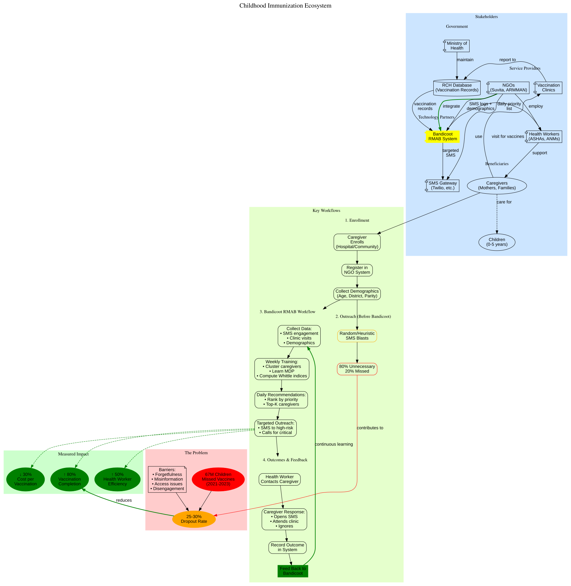
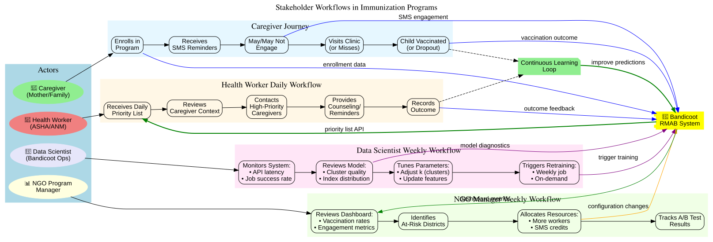
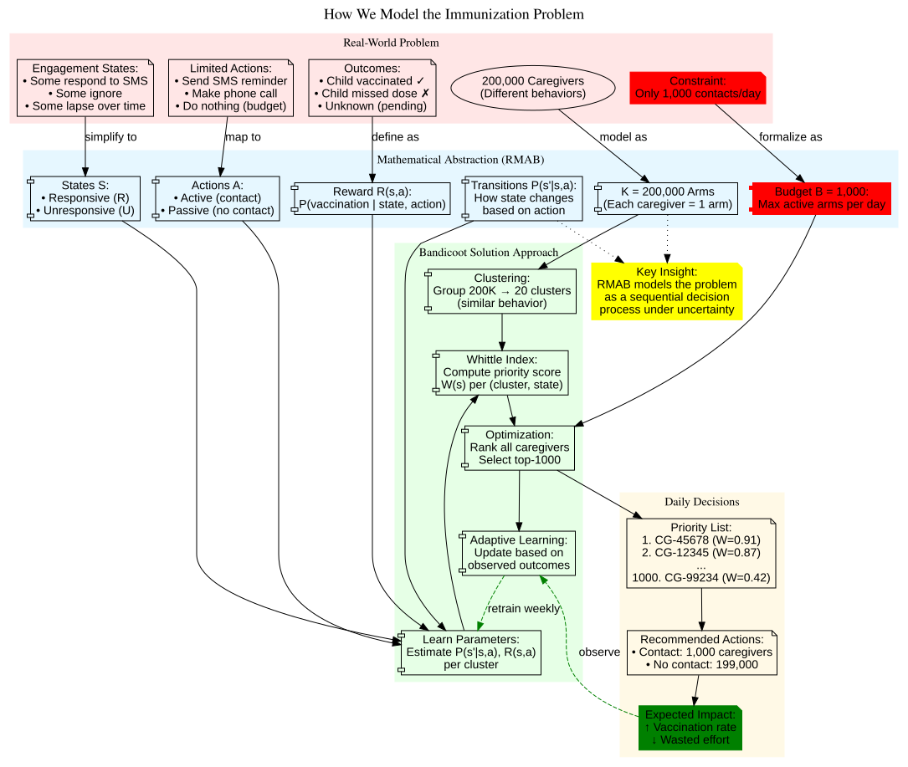
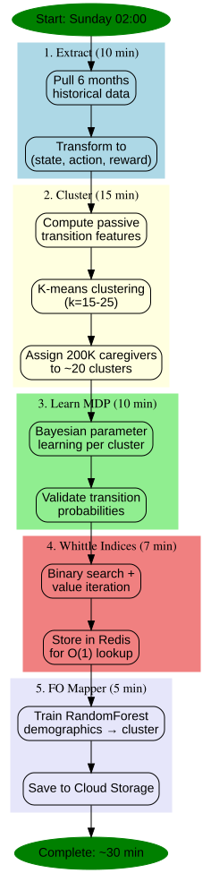
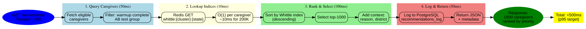
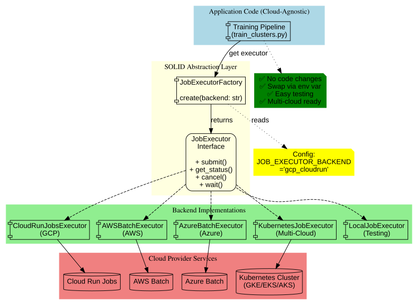
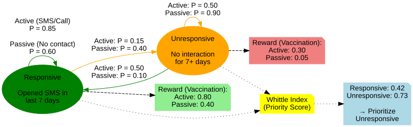

# Architecture Diagrams

Visual representations of Bandicoot's architecture and workflows.

## Diagrams

### Conceptual Diagrams (For Stakeholders)

#### 1. Immunization Ecosystem
**File:** [immunization-ecosystem.svg](./immunization-ecosystem.svg)

Complete ecosystem showing the problem, stakeholders, workflows, Bandicoot's role, and measured impact.



---

#### 2. Stakeholder Workflows
**File:** [stakeholder-workflows.svg](./stakeholder-workflows.svg)

Daily/weekly workflows for caregivers, health workers, NGO managers, and data scientists interacting with Bandicoot.



---

#### 3. Problem Modeling
**File:** [problem-modeling.svg](./problem-modeling.svg)

How we translate the real-world immunization problem into RMAB mathematical framework and Bandicoot's solution.



---

### Technical Diagrams (For Engineers)

#### 4. System Architecture
**File:** [system-architecture.svg](./system-architecture.svg)

High-level overview of data flow between Suvita systems, Bandicoot service, and outputs.


---

#### 5. RMAB Workflow (Problem → Solution → Impact)
**File:** [rmab-workflow.svg](./rmab-workflow.svg)

Conceptual flow from the vaccination dropout problem to RMAB solution and expected impact.


---

#### 6. Training Pipeline
**File:** [training-pipeline.svg](./training-pipeline.svg)

Weekly training job that clusters caregivers, learns MDP parameters, and computes Whittle indices (~30 minutes total).



---

#### 7. Recommendation Flow
**File:** [recommendation-flow.svg](./recommendation-flow.svg)

Real-time API flow for generating top-K prioritized caregivers (<500ms p95 latency target).



---

#### 8. Job Execution Abstraction
**File:** [job-execution-abstraction.svg](./job-execution-abstraction.svg)

SOLID architecture for cloud-agnostic job execution (GCP, AWS, Azure, Kubernetes).



---

#### 9. State Model (MDP)
**File:** [state-model.svg](./state-model.svg)

2-state Markov Decision Process showing transitions, rewards, and Whittle indices.



---

## Generating SVGs

To regenerate SVGs from source `.dot` files:

```bash
cd docs/diagrams
for file in *.dot; do
  dot -Tsvg "$file" -o "${file%.dot}.svg"
done
```

**Prerequisites:** `graphviz` installed (`apt install graphviz` or `brew install graphviz`)

---

## Editing Diagrams

1. Edit the `.dot` file (Graphviz DOT language)
2. Regenerate SVG: `dot -Tsvg filename.dot -o filename.svg`
3. Commit both `.dot` (source) and `.svg` (rendered)

**DOT Language Reference:** https://graphviz.org/documentation/

---

## Where Diagrams Are Used

| Diagram | Referenced In |
|---------|---------------|
| **Conceptual (For Stakeholders)** | |
| immunization-ecosystem.svg | README.md, theory/02-healthcare-problem.md |
| stakeholder-workflows.svg | README.md, docs/MVP_PRD.md |
| problem-modeling.svg | README.md, theory/01-rmab-fundamentals.md |
| **Technical (For Engineers)** | |
| system-architecture.svg | README.md, tech-design/00-overview.md |
| rmab-workflow.svg | README.md, theory/02-healthcare-problem.md |
| training-pipeline.svg | tech-design/02-rmab-core.md |
| recommendation-flow.svg | tech-design/03-api-design.md |
| job-execution-abstraction.svg | tech-design/06-job-execution.md |
| state-model.svg | theory/01-rmab-fundamentals.md |

---

**Author:** Bandicoot Team
**Last Updated:** November 2025
