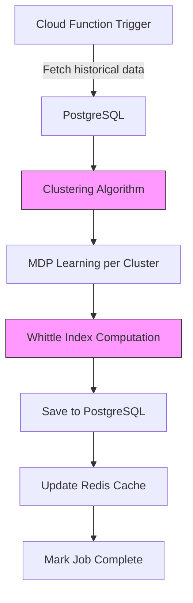
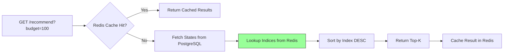
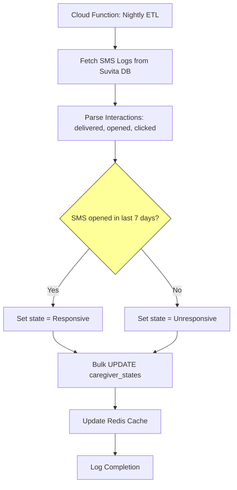

# Data Architecture & Schema Design

**Version:** 1.0
**Last Updated:** November 2025
**Parent Doc:** [00-overview.md](00-overview.md)

---

## Overview

This document defines the database schema, data flows, and storage layer for Bandicoot's RMAB system.

**Key Requirements:**
- Store 200K+ caregiver states with fast lookups
- Track cluster assignments and MDP parameters
- Log all recommendations for A/B testing
- Support both PostgreSQL (persistent) and Redis (hot cache)
- Reuse Suvita's existing PostgreSQL instance

---

## Storage Strategy

### PostgreSQL (Persistent, Source of Truth)
- Caregiver registry (demographics, cluster assignment)
- Historical states and transitions
- Cluster MDP parameters
- Recommendation logs (for evaluation)
- Training job metadata

### Redis (Hot Cache, Performance)
- Pre-computed Whittle indices (cluster_id, state) → index_value
- Current caregiver states (for fast /recommend lookups)
- FO mapper model (pickled RandomForest)
- TTL: 7 days (refreshed on retraining)

### Data Residency
- All data in GCP `asia-south1` (Mumbai region)
- No data replication outside India
- Encrypted at rest and in transit

---

## PostgreSQL Schema

### Table: `clusters`
**Purpose:** Store cluster metadata and learned MDP parameters.

```sql
CREATE TABLE clusters (
    cluster_id              INTEGER PRIMARY KEY,
    num_caregivers          INTEGER NOT NULL,
    created_at              TIMESTAMP NOT NULL DEFAULT CURRENT_TIMESTAMP,
    last_trained_at         TIMESTAMP NOT NULL,
    model_version           VARCHAR(20) NOT NULL,

    -- MDP Parameters (JSONB for flexibility)
    -- Structure: {"states": [...], "P_transition": {...}, "P_reward": {...}}
    mdp_params              JSONB NOT NULL,

    -- Cluster characteristics (for debugging/analysis)
    avg_passive_engagement  FLOAT,
    cluster_description     TEXT
);

CREATE INDEX idx_clusters_version ON clusters(model_version);
```

**Example Row:**
```json
{
  "cluster_id": 5,
  "num_caregivers": 8234,
  "mdp_params": {
    "states": ["Responsive", "Unresponsive"],
    "P_transition": {
      "Responsive": {
        "active": {"Responsive": 0.85, "Unresponsive": 0.15},
        "passive": {"Responsive": 0.60, "Unresponsive": 0.40}
      },
      "Unresponsive": {
        "active": {"Responsive": 0.50, "Unresponsive": 0.50},
        "passive": {"Responsive": 0.10, "Unresponsive": 0.90}
      }
    },
    "P_reward": {
      "Responsive": {"active": 0.80, "passive": 0.40},
      "Unresponsive": {"active": 0.30, "passive": 0.05}
    }
  },
  "avg_passive_engagement": 0.35
}
```

---

### Table: `caregiver_states`
**Purpose:** Track current engagement state for each caregiver.

```sql
CREATE TABLE caregiver_states (
    caregiver_id        VARCHAR(50) PRIMARY KEY,
    cluster_id          INTEGER NOT NULL REFERENCES clusters(cluster_id),
    current_state       VARCHAR(20) NOT NULL CHECK (current_state IN ('Responsive', 'Unresponsive')),

    -- Timestamps
    enrolled_at         DATE NOT NULL,
    warmup_end_date     DATE NOT NULL,  -- enrolled_at + 6 weeks
    last_updated        TIMESTAMP NOT NULL DEFAULT CURRENT_TIMESTAMP,

    -- A/B Testing
    ab_test_group       VARCHAR(20) CHECK (ab_test_group IN ('treatment', 'control', NULL)),
    ab_assigned_at      TIMESTAMP,

    -- Demographics (for FO mapping and analysis)
    age                 INTEGER,
    district            VARCHAR(50),
    parity              INTEGER,  -- Number of children
    phone_reliable      BOOLEAN,  -- Does phone number consistently receive SMS?

    -- Metadata
    last_sms_sent       TIMESTAMP,
    last_sms_opened     TIMESTAMP,
    last_vaccination    TIMESTAMP
);

CREATE INDEX idx_caregiver_cluster ON caregiver_states(cluster_id);
CREATE INDEX idx_caregiver_state ON caregiver_states(current_state);
CREATE INDEX idx_caregiver_warmup ON caregiver_states(warmup_end_date);
CREATE INDEX idx_caregiver_ab_group ON caregiver_states(ab_test_group) WHERE ab_test_group IS NOT NULL;
CREATE INDEX idx_caregiver_district ON caregiver_states(district);
```

**Indexes Rationale:**
- `cluster_id`: Group operations (e.g., fetch all in cluster 5)
- `current_state`: Filter by Responsive/Unresponsive
- `warmup_end_date`: Identify caregivers ready for RMAB
- `ab_test_group`: Separate analysis of treatment vs control
- `district`: Regional filtering in `/recommend`

---

### Table: `whittle_indices`
**Purpose:** Pre-computed indices for fast recommendation lookups.

```sql
CREATE TABLE whittle_indices (
    cluster_id      INTEGER NOT NULL REFERENCES clusters(cluster_id),
    state           VARCHAR(20) NOT NULL,
    index_value     FLOAT NOT NULL,
    computed_at     TIMESTAMP NOT NULL DEFAULT CURRENT_TIMESTAMP,
    model_version   VARCHAR(20) NOT NULL,

    PRIMARY KEY (cluster_id, state, model_version)
);

CREATE INDEX idx_whittle_version ON whittle_indices(model_version);
```

**Note:** This table is also mirrored in Redis for O(1) lookup during `/recommend`.

---

### Table: `recommendations_log`
**Purpose:** Audit trail for A/B testing and model evaluation.

```sql
CREATE TABLE recommendations_log (
    id                  SERIAL PRIMARY KEY,
    caregiver_id        VARCHAR(50) NOT NULL REFERENCES caregiver_states(caregiver_id),
    recommended_at      TIMESTAMP NOT NULL DEFAULT CURRENT_TIMESTAMP,
    priority_score      FLOAT NOT NULL,  -- Whittle index value
    cluster_id          INTEGER NOT NULL,
    state_at_rec        VARCHAR(20) NOT NULL,

    -- What was done with recommendation
    action_taken        VARCHAR(50),  -- 'sms_sent', 'call_scheduled', 'ambassador_notified', 'none'
    action_taken_at     TIMESTAMP,

    -- Outcome tracking
    outcome             VARCHAR(50),  -- 'vaccinated', 'missed', 'pending', 'rescheduled'
    outcome_recorded_at TIMESTAMP,

    -- Metadata
    model_version       VARCHAR(20) NOT NULL,
    ab_test_group       VARCHAR(20)
);

CREATE INDEX idx_rec_caregiver ON recommendations_log(caregiver_id);
CREATE INDEX idx_rec_timestamp ON recommendations_log(recommended_at);
CREATE INDEX idx_rec_outcome ON recommendations_log(outcome) WHERE outcome IS NOT NULL;
CREATE INDEX idx_rec_ab_group ON recommendations_log(ab_test_group) WHERE ab_test_group IS NOT NULL;
```

**Usage:**
- Off-policy evaluation (IPS, DR estimators)
- A/B test analysis (vaccination rate by group)
- Model performance tracking over time

---

### Table: `training_jobs`
**Purpose:** Track batch job executions for debugging and auditing.

```sql
CREATE TABLE training_jobs (
    job_id              SERIAL PRIMARY KEY,
    job_type            VARCHAR(50) NOT NULL,  -- 'clustering', 'index_computation', 'fo_mapping'
    started_at          TIMESTAMP NOT NULL DEFAULT CURRENT_TIMESTAMP,
    completed_at        TIMESTAMP,
    status              VARCHAR(20) NOT NULL,  -- 'running', 'success', 'failed'

    -- Inputs
    input_data_start    DATE,
    input_data_end      DATE,
    num_caregivers      INTEGER,

    -- Outputs
    num_clusters        INTEGER,
    model_version       VARCHAR(20),
    output_artifacts    JSONB,  -- e.g., {"clusters_file": "gs://...", "fo_model_file": "..."}

    -- Error handling
    error_message       TEXT,
    retry_count         INTEGER DEFAULT 0
);

CREATE INDEX idx_training_status ON training_jobs(status);
CREATE INDEX idx_training_type ON training_jobs(job_type);
CREATE INDEX idx_training_version ON training_jobs(model_version) WHERE model_version IS NOT NULL;
```

---

## Redis Schema

### Key Patterns

#### 1. Whittle Indices
```
Key:   whittle:{model_version}:{cluster_id}:{state}
Value: {index_value}  (float)
TTL:   7 days

Example:
  whittle:v1.0.2:5:Responsive → 0.87
  whittle:v1.0.2:5:Unresponsive → 0.42
```

#### 2. Current States (Hot Cache)
```
Key:   state:{caregiver_id}
Value: {cluster_id, current_state, last_updated}  (JSON)
TTL:   1 day (refreshed nightly)

Example:
  state:CG-12345 → {"cluster_id": 5, "current_state": "Unresponsive", "last_updated": "2025-11-22T10:00:00Z"}
```

#### 3. FO Mapper Model
```
Key:   fo_mapper:{model_version}
Value: {pickled_sklearn_model}  (bytes)
TTL:   30 days

Example:
  fo_mapper:v1.0.2 → <binary RandomForest model>
```

#### 4. Recommendation Cache
```
Key:   recommend:{date}:{budget}:{filters_hash}
Value: [list of caregiver_ids]  (JSON array)
TTL:   1 hour (short TTL, recommendations should be fresh)

Example:
  recommend:2025-11-22:100:abc123 → ["CG-12345", "CG-67890", ...]
```

---

## Data Flows

### Flow 1: Batch Training (Weekly)



**Steps:**
1. **Extract:** Query PostgreSQL for last 6 months of SMS/vaccination data
2. **Cluster:** k-means on passive transition probabilities → 20 clusters
3. **Learn:** bayesianbandits per cluster → MDP parameters
4. **Compute:** Whittle indices for all (cluster, state) pairs
5. **Store:** Save to `clusters` and `whittle_indices` tables
6. **Cache:** Populate Redis with indices and model version
7. **Log:** Record job in `training_jobs` table

**Schedule:** Weekly (every Sunday at 02:00 UTC+5:30)

---

### Flow 2: Real-Time Recommendation



**Steps:**
1. **Check Cache:** Look for `recommend:{date}:{budget}:{filters_hash}` in Redis
2. **Fetch States:** If miss, query `caregiver_states` for active caregivers (post-warmup)
3. **Lookup Indices:** Get Whittle index from Redis for (cluster_id, state)
4. **Rank:** Sort caregivers by index descending
5. **Filter:** Apply district/region filters if requested
6. **Return:** Top-K caregiver IDs with scores
7. **Cache:** Store result in Redis with 1-hour TTL

**Target Latency:** <500ms p95

---

### Flow 3: State Update (Nightly)



**Rules:**
- `Responsive`: SMS opened/clicked within 7 days
- `Unresponsive`: No interaction for 7+ days
- **Bonus:** If vaccination completed → stay in current state (already engaged)

**Schedule:** Nightly at 01:00 UTC+5:30

---

## Data Sources (From Suvita)

### Required Access

**1. Caregiver Registry (Read-Only)**
```sql
-- Suvita's existing table (example schema)
SELECT
    caregiver_id,
    child_name,
    caregiver_phone,
    date_of_birth,
    district,
    enrollment_date,
    vaccination_schedule  -- JSON array of due dates
FROM suvita_production.caregivers
WHERE status = 'active';
```

**2. SMS Delivery Logs**
```sql
SELECT
    caregiver_id,
    message_id,
    sent_at,
    delivered_at,
    opened_at,  -- If available
    clicked_at,  -- If tracking links
    status  -- 'sent', 'delivered', 'failed', 'bounced'
FROM suvita_production.sms_logs
WHERE sent_at >= NOW() - INTERVAL '6 months';
```

**3. Vaccination Records (Government RCH Mirror)**
```sql
SELECT
    caregiver_id,
    child_id,
    vaccine_name,
    scheduled_date,
    actual_date,
    clinic_location,
    administered_by
FROM suvita_production.vaccinations
WHERE scheduled_date >= NOW() - INTERVAL '6 months';
```

---

## Data Quality Checks

### Pre-Training Validation
```python
def validate_training_data(df):
    """Run before clustering to ensure data quality."""
    checks = []

    # 1. Minimum sample size
    checks.append(('num_caregivers', len(df) >= 1000))

    # 2. No missing cluster-critical fields
    required = ['caregiver_id', 'sms_sent', 'sms_delivered']
    checks.append(('required_fields', df[required].notna().all().all()))

    # 3. Temporal coverage (at least 3 months)
    date_range = (df['sms_sent'].max() - df['sms_sent'].min()).days
    checks.append(('temporal_coverage', date_range >= 90))

    # 4. Reasonable engagement rates (5-95%)
    engagement_rate = df['sms_opened'].notna().mean()
    checks.append(('engagement_rate', 0.05 <= engagement_rate <= 0.95))

    # Raise if any check fails
    for name, passed in checks:
        if not passed:
            raise ValueError(f"Data quality check failed: {name}")

    return True
```

### Runtime Validation
```python
def validate_recommendation_inputs(caregiver_ids, states):
    """Validate inputs to /recommend endpoint."""
    assert len(caregiver_ids) == len(states)
    assert all(s in ['Responsive', 'Unresponsive'] for s in states)
    assert len(caregiver_ids) > 0
```

---

## Database Migrations

### Strategy: Alembic
- Version-controlled schema changes
- Rollback support
- Separate migrations for PostgreSQL and Redis

### Example Migration (Add A/B Test Column)
```python
# migrations/versions/001_add_ab_test_group.py

from alembic import op
import sqlalchemy as sa

def upgrade():
    op.add_column('caregiver_states',
        sa.Column('ab_test_group', sa.String(20), nullable=True))

    op.add_column('caregiver_states',
        sa.Column('ab_assigned_at', sa.TIMESTAMP, nullable=True))

    op.create_index('idx_caregiver_ab_group', 'caregiver_states',
                    ['ab_test_group'],
                    postgresql_where=sa.text('ab_test_group IS NOT NULL'))

def downgrade():
    op.drop_index('idx_caregiver_ab_group')
    op.drop_column('caregiver_states', 'ab_assigned_at')
    op.drop_column('caregiver_states', 'ab_test_group')
```

---

## Backup & Recovery

### PostgreSQL Backups
- **Automated Daily Snapshots:** Cloud SQL automated backups (7-day retention)
- **Point-in-Time Recovery:** Enabled (up to 7 days back)
- **Manual Snapshots:** Before each training job

### Redis Backups
- **Persistence:** RDB snapshots every 6 hours
- **AOF Logging:** Disabled (indices are recomputable)
- **Recovery:** Repopulate from PostgreSQL if Redis fails

### Disaster Recovery Plan
1. **Redis Failure:** Temporarily serve from PostgreSQL (higher latency, acceptable)
2. **PostgreSQL Failure:** Restore from latest snapshot, replay missed transactions
3. **Both Fail:** Fallback to random recommendations (monitor closely)

---

## Performance Optimization

### PostgreSQL
- **Partitioning:** `recommendations_log` by month (for fast historical queries)
- **Materialized Views:** Pre-aggregated A/B test results
- **Connection Pooling:** PgBouncer (max 100 connections)

### Redis
- **Eviction Policy:** `volatile-lru` (evict oldest indices first)
- **Memory Limit:** 1GB (alert if >90% used)
- **Persistence:** RDB snapshots (no AOF for performance)

### Query Examples

**Fast Recommendation Lookup:**
```sql
-- Optimized for <100ms
SELECT cs.caregiver_id, wi.index_value
FROM caregiver_states cs
JOIN whittle_indices wi
  ON cs.cluster_id = wi.cluster_id
  AND cs.current_state = wi.state
WHERE cs.warmup_end_date <= CURRENT_DATE
  AND cs.ab_test_group IN ('treatment', NULL)  -- Exclude control
ORDER BY wi.index_value DESC
LIMIT 100;
```

**A/B Test Analysis:**
```sql
-- Vaccination rate by group
SELECT
    ab_test_group,
    COUNT(*) as total_recommendations,
    SUM(CASE WHEN outcome = 'vaccinated' THEN 1 ELSE 0 END) as vaccinations,
    ROUND(100.0 * SUM(CASE WHEN outcome = 'vaccinated' THEN 1 ELSE 0 END) / COUNT(*), 2) as vaccination_rate_pct
FROM recommendations_log
WHERE recommended_at >= NOW() - INTERVAL '4 weeks'
  AND ab_test_group IS NOT NULL
GROUP BY ab_test_group;
```

---

## Data Retention Policy

| Data Type | Retention | Rationale |
|-----------|-----------|-----------|
| Current caregiver states | Until inactive | Operational need |
| Historical states | 2 years | Model retraining, analysis |
| Recommendations log | 2 years | Evaluation, audits |
| Training job logs | 1 year | Debugging, compliance |
| Redis cache | 7 days | Recomputable, transient |

---

## Next Steps
1. Review with Suvita IT team for PostgreSQL schema compatibility
2. Set up staging database with sample data
3. Implement Alembic migrations
4. Load test Redis with 200K caregiver states
5. Document data access procedures and credentials
